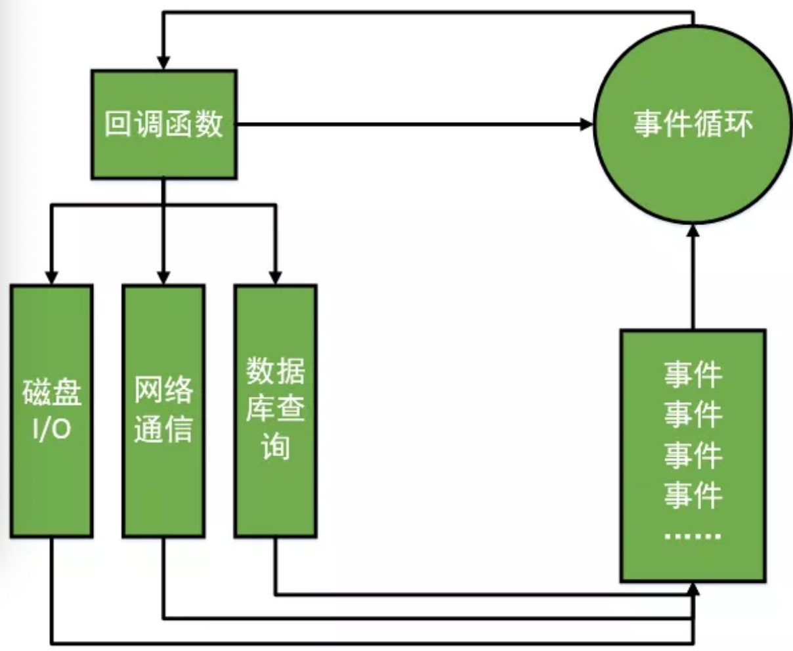

### 非祖塞异步io

由于 `Node.js `中采用了非阻塞型`I/O`机制，因此在执行了访问数据库的代码之后，将立即转而执行其后面的代码，把数据库返回结果的处理代码放在回调函数中，从而提高了程序的执行效率。 

当某个`I/O`执行完毕时，将以事件的形式通知执行`I/O`操作的线程，线程执行这个事件的回调函数。为了处理异步`I/O`，线程必须有事件循环，不断的检查有没有未处理的事件，依次予以处理。 

### 单线程

`Node.js` 不为每个客户连接创建一个新的线程，而仅仅使用一个线程。当有用户连接了，就触发一个内部事件，通过非阻塞`I/O`、事件驱动机制，让 `Node.js` 程序宏观上也是并行的。使用` Node.js` ，一个 8GB 内存的服务器，可以同时处理超过 4 万用户的连接。 

### 事件驱动

`Node.js `中，在一个时刻，只能执行一个事件回调函数，但是在执行一个事件回调函数的中途，又有其他事件产生，可以转而处理其他事件（比如，又有新用户连接了），然后返回继续执行原事件的回调函数，这种处理机制，称为“事件环”机制。

 `Node.js` 底层是 `C++（V8也是 C++写的）`。底层代码中，近半数都用于事件队列、回调函数队列的构建。用事件驱动来完成服务器的任务调度 



Node.js 官网的解释图

```
   ┌───────────────────────────┐
┌─>│           timers          │
│  └─────────────┬─────────────┘
│  ┌─────────────┴─────────────┐
│  │     pending callbacks     │
│  └─────────────┬─────────────┘
│  ┌─────────────┴─────────────┐
│  │       idle, prepare       │
│  └─────────────┬─────────────┘      ┌───────────────┐
│  ┌─────────────┴─────────────┐      │   incoming:   │
│  │           poll            │<─────┤  connections, │
│  └─────────────┬─────────────┘      │   data, etc.  │
│  ┌─────────────┴─────────────┐      └───────────────┘
│  │           check           │
│  └─────────────┬─────────────┘
│  ┌─────────────┴─────────────┐
└──┤      close callbacks      │
   └───────────────────────────┘

```

### 跨平台
起初，`Node` 只能在` Linux` 平台上运行。后来随着 `Node`的发展，微软注意到了它的存在，并投入了一个团队帮助 `Node` 实现 `Windows` 平台的兼容，在`v0.6.0`版本发布时，`Node` 已经能够直接在` Window `平台运行了


### 单线程带来的弊端
* 1.无法利用多核 CPU
* 2.错误会引起整个应用退出无法继续调用异步I/O
* 3.大量计算占用 CPU 导致无法继续调用异步I/O

弊端 1:解决方案 

* （1）一些管理工具比如pm2，forever 等都可以实现创建多进程解决多核 CUP 的利用率问题。 
* （2）在 v0.8 版本之前，实现多进程可以使用child_process 
* （3）在 v0.8 版本之后，可以使用cluster模块，通过主从模式，创建多个工作进程解决多核 CPU 的利用率问题。 

弊端 2:解决方案

 * （1）Nnigx 反向代理，负载均衡，开多个进程，绑定多个端口； 
 * （2） 一些管理工具比如pm2，forever 等都可以实现进程监控，错误自动重启等 
 * （3）开多个进程监听同一个端口，使用 Node 提供的cluster模块； 
 * （4）未出现cluster之前，也可以使用child_process,创建多子线程监听一个端口。 
 * （5）这里说明下，有上面的这些解决方案，但是写 node 后端代码的时候，异常抛出try catch显得格外有必要。

弊端 3:解决方案 
  * （1）可以把大量的密集计算像上面一样拆分成多个子线程计算.
  * （2）但是如果不允许拆分，想计算 100 万的大数据，在一个单线程中，Node 确实显得无能为力，这本身就是 V8 内存限制的弊端。  

  ### Node.js 的应用场景

  善于I/O，不善于计算。因为Node.js最擅长的就是任务调度，如果你的业务有很多的 CPU 计算，实际上也相当于这个计算阻塞了这个单线程，就不太适合 Node 开发，但是也不是没有解决方案，只是说不太适合。
  
  当应用程序需要处理大量并发的I/O，而在向客户端发出响应之前，应用程序内部并不需要进行非常复杂的处理的时候，Node.js非常适合。Node.js也非常适合与websocket配合，开发长连接的实时交互应用程序。 
  
  具体场景可以表现为如下：

  * 第一大类：用户表单收集系统、后台管理系统、实时交互系统、考试系统、联网软件、高并发量的 web 应用程序；

  * 第二大类：基于 web、canvas 等多人联网游戏； 
  * 第三大类：基于 web 的多人实时聊天客户端、聊天室、图文直播；
  * 第四大类：单页面浏览器应用程序；
  *  第五大类：操作数据库、为前端和移动端提供基于json的 API； 


  ### 一些文档

  [node的api http://nodejs.cn/api/]()